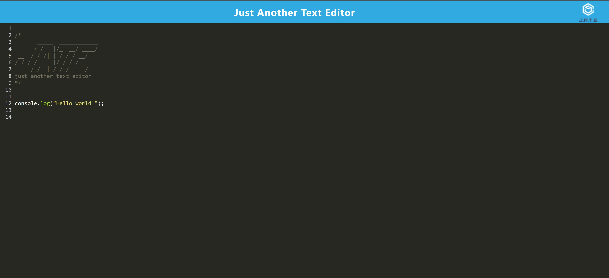

# pwa-text-editor

Text editor that runs in the browser with JavaScript syntax highlighting.

## Installation

To install necessary dependencies, run the following command:

```sh
npm install
```

followed by the following command to install dependencies for the sub folders (client, server):

```sh
npm run install
```

## Usage

- Run `npm run start` to build and start the application.

## Live URL and screenshot

Live URL: <https://anisha-text-editor.herokuapp.com/>



## Helpful resources

- <https://developers.google.com/codelabs/pwa-training/pwa03--working-with-workbox?hl=vi#3>
- <https://developer.mozilla.org/en-US/docs/Web/Progressive_web_apps/Add_to_home_screen#a2hs_on_desktop>

## License

[](https://opensource.org/licenses/MIT)
